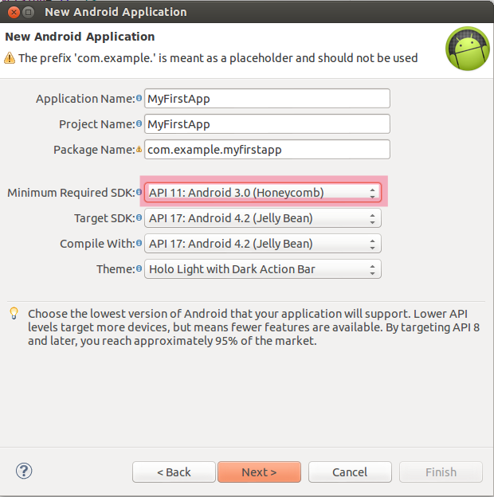
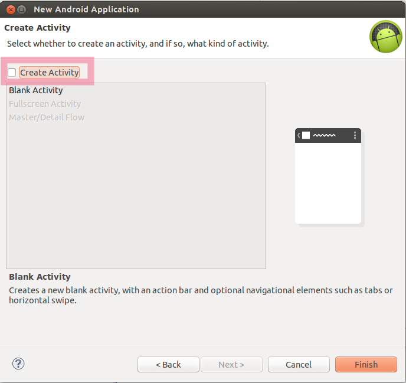
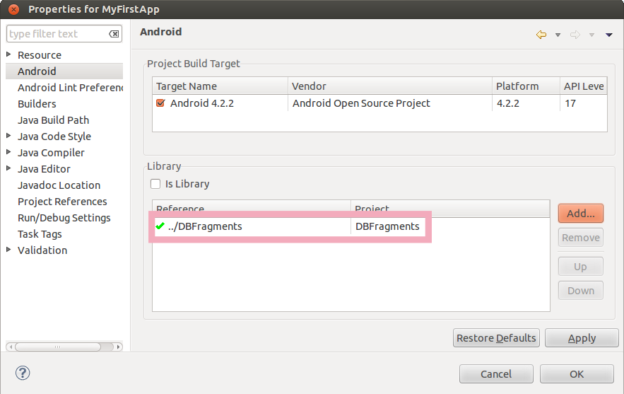
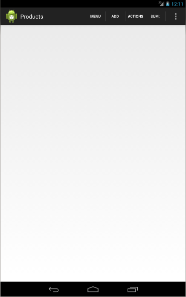

# DBFragments tutorial

## 1. Prerequisites

See DBFragments' README.md file for system requirements and installation process.

If you are not familiar with Android application development, see [Training for Android developers](http://developer.android.com/training/index.html).

## 2. Creating your first application

Assume we need a simple application to manage records of products with poduct ID code, name and price.

### 2.1 Preparation

The following steps are usual for all DBFragments applications (boring as for RAD, but maybe automated by wizard in future).

In Eclipse: open Android application project wizard (*'File'* -> *'New'* -> *'Project...'* -> *'Android Application Project'*).
On the first page of the wizard select *'API 11'* in *'Minimum Requred SDK'*.

On the *'Create Activity'* page uncheck *'Create Activity'*.

Clean up the content of AndroidManifest.xml and put this XML code into it:

	<manifest xmlns:android="http://schemas.android.com/apk/res/android"
	    package="com.example.myfirstapp"
	    android:versionCode="1"
	    android:versionName="1.0" >
	
	    <uses-sdk
	        android:minSdkVersion="11"
	        android:targetSdkVersion="18" />
	    <uses-permission android:name="android.permission.WRITE_EXTERNAL_STORAGE"/>
	
	
	    <application
	        android:allowBackup="true"
	        android:icon="@drawable/ic_launcher"
	        android:label="@string/app_name"
	        android:theme="@style/AppTheme" android:name=".Application">
	        
	        <activity
	            android:name="db.fragments.MainActivity"
	            android:label="@string/title_activity_main"> 
	            <intent-filter>
	                <action android:name="android.intent.action.MAIN" />
	                <category android:name="android.intent.category.LAUNCHER" />
	            </intent-filter>
	        </activity>
	        
	        <activity android:name="db.fragments.EditActivity"
	            android:windowSoftInputMode="stateHidden" />
	
	        <activity android:name="db.fragments.DetailActivity" />
	        
	        <activity android:name="db.fragments.ActionActivity" />
	        
	    </application>
	
	</manifest>

Change *'package'* attribute of the manifest to your package name.

Add application title as string resource "title_activity_main" in res/values/strings.xml:

	<string name="title_activity_main">My First Application</string>

Add reference to DBFragments library project in current project properties:
 

Every DBFragments application must have two mandatory classes: *Application* and *Config*.

Create *Application* class with this content (the same for all DBFragments applications):

    package com.example.myfirstapp;
    
    import db.fragments.DBApplication;
    
    public class Application extends DBApplication {
    	
    	public void onCreate() {
    		setPackageName(getApplicationContext().getPackageName());
    		super.onCreate();
    	}
    
    }
    
*Config* class will be defined in the next chapter.

    
### 2.2 Implementing application logic

Create *Products* class to describe database table structure:

    package com.example.myfirstapp;
    
    import db.fragments.Column;
    import db.fragments.DBFragment;
    import db.fragments.G;
    
    /**
     * This class creates tb_products table with fields f_code_prod, f_name,
     * f_price.
     */
        public class Products extends DBFragment {
    
    	public Products() {
    		tableName = "tb_products";
    		title = "Products";
    
    		columns.add(new Column(this).name("f_code_prod").dataType(G.INTEGER)
    				.title("Code"));
    		columns.add(new Column(this).name("f_name").dataType(G.TEXT)
    				.title("Name"));
    		columns.add(new Column(this).name("f_price").dataType(G.REAL)
    				.title("Price").constr(G.IntZero));
    
    		listfields = new String[] { "f_code_prod", "f_name", "f_price" };
    	}

    }

Notice that DBFragments has been ported from DBFrames Python framework, so it uses public non-static and non-final fields in its classes for porting convenience (so far).
        
Create *Config* class to define initialization and menu orders for custom classes:

    package com.example.myfirstapp;
    
    import java.util.Arrays;
    
    import db.fragments.G;
    
    public class Config {
    
    	// Only one class to initialize and put into the application menu
    	public static void init() {
    		G.initorder = Arrays.asList("Products");
    		G.menuorder = Arrays.asList("Products");
    	}
    
    }
    
That's it! Start te app and you can see the screen with empty list like this:
    

In list view you can use the following action bar buttons:

* 'Menu' - choose your objects defined in *G.menuorder*
* 'Add' - add new list item (database record)
* 'Actions' - choose actions defined in *G.actions*
* 'Filter' - filter list items with columns which have *Column.filter(..)* in their definition

'Sum:' label in action bar is the place for sum result for the field described as *'total = fieldname'* in class definition.

Also, you can press list item and edit data or long press list item to delete it. 

So, press *'Add'* to add new record:

Enter data and push back button to return to list view.

See [examples](./examples/) for more complicated applications.

